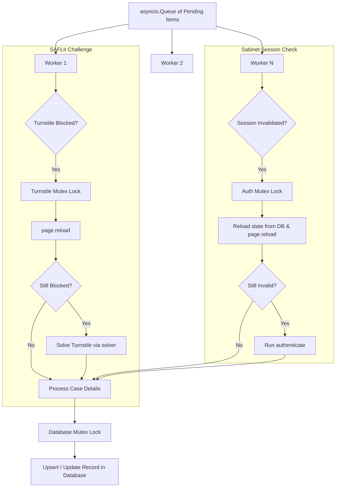

# Concurrent Detailing for SAFLII and Sabinet Scrapers

Implement concurrent worker tasks in both the SAFLII and Sabinet scrapers to utilize the system's 8 CPU cores and 8 GB RAM, avoiding sequential bottlenecks.

## Proposed Architecture

### 1. Concurrency Limits
* Read `concurrency` from `extraction_params` configuration (default: 8).
* Spawn $N$ worker tasks that process pending records concurrently using an `asyncio.Queue`.

### 2. Mutex-Locked Database Access
* Keep a shared `db_lock = asyncio.Lock()` initialized in the base/scrapers to serialize all database operations, protecting the single `asyncpg` connection.

### 3. Cooperative Auth Session Lock (Sabinet)
* Introduce `auth_lock = asyncio.Lock()` in `SabinetScraper`.
* When a worker detects that the authenticated session is invalidated:
  1. It acquires the `auth_lock`.
  2. It reloads the progress state and context storage state from the DB, and recycles/reloads the page to see if another worker already re-authenticated.
  3. If still invalid, it runs the full `authenticate()` workflow once, updating the storage state in DB.
  4. Any waiting workers will pick up the updated storage state upon acquiring the lock, avoiding redundant logins.

---

## Proposed Changes

### [base_scraper.py](file:///home/tiaanf/Dev/coeus/extraction_workers/base_scraper.py)

#### [MODIFY] [base_scraper.py](file:///home/tiaanf/Dev/coeus/extraction_workers/base_scraper.py)
* Add `self.db_lock = asyncio.Lock()` inside `BaseScraper.__init__`.

---

### [sabinet_scraper.py](file:///home/tiaanf/Dev/coeus/extraction_workers/sabinet_scraper.py)

#### [MODIFY] [sabinet_scraper.py](file:///home/tiaanf/Dev/coeus/extraction_workers/sabinet_scraper.py)
* Add `self.auth_lock = asyncio.Lock()` to `__init__`.
* Rewrite `detailing` method to use concurrent workers and a task queue.
* Wrap `db_storage.update_record_data` inside `async with self.db_lock`.
* Wrap the self-healing authentication check block inside `async with self.auth_lock`.
* Remove or adjust the 60-second block sleep per worker (rate limits should be managed per-worker with smaller sleeps or cooperative throttling).

---

## Verification Plan

### Automated Verification
* Check syntax and compile structure of Python files.

### Manual Verification
* Run both scrapers to verify concurrent detailing works without DB collisions or login conflicts.
