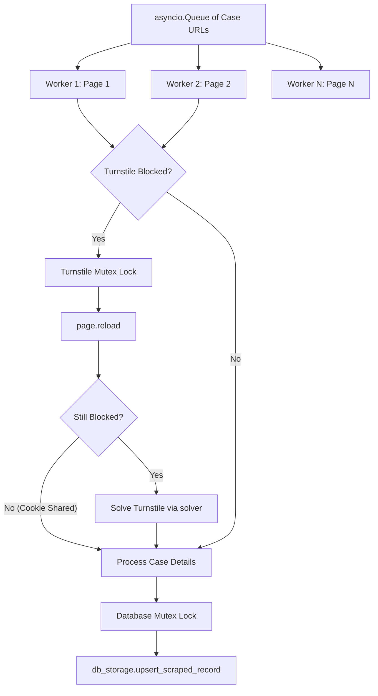

# Concurrent Detailing for SAFLII Scraper

Implement concurrent worker tasks in the SAFLII scraper to utilize the user's 8 CPU cores and 8 GB RAM. This will bypass the single-thread page-by-page bottleneck and allow scraping multiple cases in parallel.

## Proposed Architecture

### 1. Cooperative Turnstile Mutex Lock
Since all worker pages share the same Playwright `BrowserContext`, they also share all cookies (including Cloudflare's `cf_clearance` cookie).
* When a worker detects a `BLOCKED` state, it acquires a `turnstile_lock` mutex.
* Under the lock, it reloads the page to see if another worker already cleared the Turnstile wall.
* If reload clears it, the worker returns immediately.
* If still blocked, it solves Turnstile, saving the cookie for all pages in the context, and releases the lock.

### 2. Mutex-Locked Database Write
`asyncpg` connection object is not coroutine-safe.
* Introduce a `db_lock = asyncio.Lock()` to serialize all database operations across workers.
* Since database upserts are extremely fast (few milliseconds), serializing writes does not bottleneck the scraping loop.

### 3. Concurrency Limit
* Read `concurrency` from `extraction_params` configuration (default: 8).
* Spawn $N$ worker tasks that process case URLs from an `asyncio.Queue`.

---

## Proposed Changes

### [new_saflii_scraper.py](file:///home/tiaanf/Dev/coeus/extraction_workers/new_saflii_scraper.py)

#### [MODIFY] [new_saflii_scraper.py](file:///home/tiaanf/Dev/coeus/extraction_workers/new_saflii_scraper.py)

* Add `self.db_lock` and `self.turnstile_lock` inside `__init__`.
* Rewrite `handle_turnstile_challenge` to implement page reloading under `self.turnstile_lock` before solving.
* Rewrite `detailing` to spawn concurrent worker coroutines processing URLs from a shared `asyncio.Queue`.
* Wrap `db_storage.upsert_scraped_record` inside `async with self.db_lock`.

---

## Verification Plan

### Automated Verification
* Run structure and syntax verification check on Python files.

### Manual Verification
* Run the SAFLII scraper and monitor stdout logs to verify:
  1. Multiple workers process case links concurrently.
  2. Turnstile is only solved once (or rarely) and shared across workers using reloads.
  3. No asyncpg `InterfaceError: another operation is in progress` errors.
