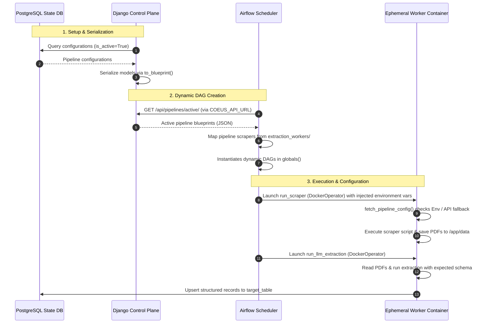

# Coeus Pipeline Architecture Analysis

This document provides a comprehensive technical analysis of the Coeus scraping, extraction, and orchestration architecture. It details how pipeline configurations defined in the Django Control Plane are serialized, transmitted to the Apache Airflow Orchestrator, dynamically translated into Airflow DAGs, and executed in ephemeral Docker containers.

---

## 🏗️ System Architecture Overview

Project Coeus uses a decoupled, three-tier architecture:
1. **Control Plane (Django)**: Manages metadata, configuration targets, CSS selectors, schedules, and LLM extraction rules. It exposes active configurations via a REST API.
2. **Orchestrator (Apache Airflow)**: Periodically queries the Control Plane to dynamically generate, schedule, and instantiate pipeline DAGs.
3. **Execution Layer (Ephemeral Docker Containers)**: Ephemeral workers run dedicated scraping scripts (using Playwright/BeautifulSoup) and LLM-based extraction jobs.



---

## 1. ⚙️ Django Configuration & Serialization

The definition of a Coeus pipeline starts in the Django Control Plane inside the `PipelineConfiguration` model (`control_plane/pipelines/models.py`).

### 📋 Model Configurations
The model configuration is structured into three clear logical phases:

| Phase | Field Name | Type | Description |
| :--- | :--- | :--- | :--- |
| **Metadata & Scheduling** | `name` | CharField | Pipeline name (unique). |
| | `scraper_type` | CharField | Chooses the target script (e.g., `ccma_playwright`, `sedarplus`, `saflii`). |
| | `is_active` | BooleanField | Pauses/resumes scheduling. |
| | `schedule_cron` | CharField | Standard cron format (e.g., `0 0 * * *`). |
| **Phase 1: Ingestion** | `start_url` | URLField | Root entry-point for crawler. |
| | `target_css_selector_categories` | CharField | Selector for category navigation. |
| | `target_css_selector_documents` | CharField | Selector for PDF/asset downloads. |
| | `allow_insecure_https` | BooleanField | Bypass SSL verification in Playwright. |
| | `allow_insecure_requests` | BooleanField | Bypass SSL verification in urllib3/requests. |
| | `pagination_strategy` | CharField | Strategies: URL parameter, next button click, or infinite scroll. |
| **Phase 2: LLM Extraction** | `requires_extraction` | BooleanField | Whether to process documents via LLM. |
| | `llm_engine` | CharField | Selects the model provider/engine (e.g., `gemini-cli`). |
| | `pydantic_schema_name` | CharField | Expected schema class in `schemas.py` for structured outputs. |
| | `extraction_instructions` | TextField | Custom LLM prompts or guidelines. |
| | `extraction_params` | JSONField | Key-value filters passed to the scraper (e.g. keywords). |
| **Phase 3: Loading** | `target_table` | CharField | Destination table where extracted JSON records are loaded. |

### 🔄 Serialization (`to_blueprint`)
The `to_blueprint()` method translates Django database state into a structured JSON structure for Airflow consumption:

```python
def to_blueprint(self) -> dict:
    return {
        "pipeline_id": self.name.lower().replace(" ", "_").replace("-", "_"),
        "name": self.name,
        "scraper_type": self.scraper_type,
        "is_active": self.is_active,
        "schedule": self.schedule_cron,
        "metadata": {
            "industry": self.industry,
            "document_type": self.document_type,
        },
        "phase_1_ingestion": {
            "start_url": self.start_url,
            "target_asset_selector": self.target_css_selector,
            "target_css_selector_categories": self.target_css_selector_categories,
            "target_css_selector_documents": self.target_css_selector_documents,
            "allow_insecure_https": self.allow_insecure_https,
            "allow_insecure_requests": self.allow_insecure_requests,
            "pagination_strategy": self.pagination_strategy,
        },
        "phase_2_extraction": {
            "requires_extraction": self.requires_extraction,
            "engine": self.llm_engine,
            "expected_schema": self.pydantic_schema_name,
            "extraction_instructions": self.extraction_instructions,
            "extraction_params": self.extraction_params,
        },
        "phase_3_loading": {"table_name": self.target_table},
    }
```

The Django API endpoint `/api/pipelines/active/` returns a JSON object containing this blueprint for every active pipeline:
```json
{
  "pipelines": [
     // List of serialized blueprint objects
  ]
}
```

---

## 2. 🔀 Dynamic DAG Generation (Airflow Orchestrator)

The Airflow dynamic factory (`orchestration/airflow_dags/dynamic_factory.py`) operates globally on the Airflow Scheduler.

### 🔍 Scraper Discovery Mapping
The scheduler queries local directory trees on the host to discover available Python scraper scripts.
- **Candidates searched**: `/app/extraction_workers`, `/opt/airflow/extraction_workers`, and `../extraction_workers` (relative to the DAG script).
- **Mapping mechanism**: Any script matching `*_scraper.py` is parsed. The prefix is used as the key, mapping to the container target location `/app/extraction_workers/{filename}`. E.g., `sedarplus_scraper.py` maps to `sedarplus`.

### ⚡ Dynamic DAG Instantiation
For every blueprint fetched from Django:
1. A unique DAG is configured:
   - `dag_id`: `extract_{pipeline_id}`
   - `schedule`: The exact cron schedule expression provided by the blueprint.
   - `start_date`: Defaults to `datetime(2024, 1, 1)` with `catchup=False` to prevent run-backs.
2. The dynamic DAG is registered in Python's global namespace: `globals()[dag_id] = dag`.

---

## 3. 🐋 Task Construction & Bind Mounts

The orchestrator builds up to two Docker tasks for each pipeline depending on `requires_extraction`.

### 🛡️ Task 1: Ingestion (`run_scraper`)
Implemented via `DockerOperator` executing `ghcr.io/8ohm-technologies/coeus-worker:latest`.

- **Environment Variable Injection**:
  Airflow extracts parameters from the blueprint and maps them into container-accessible variables:
  - `PYTHONPATH`: `/app:/app/solver/src`
  - `HF_TOKEN`: Hugging Face Hub token (read from Scheduler environment).
  - `PIPELINE_CONFIG`: Set to `COEUS_API_URL`.
  - `START_URL`: Ingest start URL.
  - `DOCUMENT_TYPE`: Document category metadata.
  - `CAT_SELECTOR` / `DOC_SELECTOR`: Selectors for categories and files.
  - `ALLOW_INSECURE_HTTPS` / `ALLOW_INSECURE_REQUESTS`: Insecure options.
  - `EXTRACTION_PARAMS`: Ingestion parameter settings (JSON string).

- **Execution Command**:
  - For `saflii` scraper: Command launches `Xvfb` (Virtual Framebuffer) on display `:99` to support headless Playwright browser rendering on Linux:
    `bash -c 'Xvfb :99 -screen 0 1280x720x24 & export DISPLAY=:99 && sleep 1 && python {worker_script} {worker_args}'`
  - For all other scrapers: Direct execution of the script:
    `python {worker_script} {worker_args}`
  - Both commands accept worker CLI arguments: `--pipeline_name '{pipeline_id}'` (with additions for `mantech` search keywords).

- **Bind Mounts**:
  1. **Data Storage**: `HOST_DATA_PATH` (e.g. `/tmp/coeus_data` or a volume root) is bound to `/app/data` inside the container. This persists crawled files.
  2. **Scraper Scripts**: `host_workers_path` is bound to `/app/extraction_workers` to allow local edits to scraper code to reflect instantly in the container.
  3. **Models Cache**: A named Docker volume `huggingface_cache` is bound to `/root/.cache/huggingface` to cache Hugging Face models used by the hCaptcha solver, preventing costly re-downloads on every run.

### 🧠 Task 2: Extraction (`run_llm_extraction`)
If `requires_extraction` is enabled, a downstream extraction task is appended:
- **Command**: `python /app/extraction_workers/llm_extractor.py --pipeline_name '{pipeline_id}' --schema '{expected_schema}'`
- **Dependency**: `scrape_task.set_downstream(extract_task)`
- **Bind Mounts**:
  - `HOST_DATA_PATH` is bound to `/app/data/scraped_pdfs` to locate the source PDFs.
  - `host_workers_path` is bound to `/app/extraction_workers`.

---

## 4. 🚀 Execution & Configuration Fallbacks

When an ephemeral worker starts, it loads its configuration dynamically using `fetch_pipeline_config()` in `extraction_workers/utils.py`.

```
                  ┌─────────────────────────────┐
                  │ Ephemeral Container Startup │
                  └──────────────┬──────────────┘
                                 │
                     [fetch_pipeline_config()]
                                 │
             ┌───────────────────┴───────────────────┐
             ▼                                       ▼
  Are env vars populated?                 Are env vars empty?
  (START_URL & DOCUMENT_TYPE)             (e.g., direct CLI test run)
             │                                       │
             ▼                                       ▼
 ┌───────────────────────┐               ┌───────────────────────┐
 │ Parse env config block│               │ Query Django API URL  │
 │ (AST/JSON parse params)               │  (COEUS_API_URL)      │
 └───────────┬───────────┘               └───────────┬───────────┘
             │                                       │
             │                                       ▼
             │                           ┌───────────────────────┐
             │                           │ Match pipeline by ID  │
             │                           │ & flatten metadata    │
             │                           └───────────┬───────────┘
             │                                       │
             └───────────────────┬───────────────────┘
                                 │
                                 ▼
                     ┌───────────────────────┐
                     │ Apply SSL disables &  │
                     │ return unified config │
                     └───────────────────────┘
```

1. **Environment Variables Check**: It looks for injected keys like `START_URL` and `DOCUMENT_TYPE`.
   - If present, it parses `EXTRACTION_PARAMS` using `ast.literal_eval` (to safely handle Python literals with single quotes) or falls back to standard JSON loading.
2. **API Fallback**: If those environment variables are missing (e.g., during direct developer testing inside a shell), it query the Django `COEUS_API_URL` to fetch all active blueprints, matches the pipeline by name or ID, and flattens the nested blueprint phases into a unified configuration.
3. **Database Upserts**: The extraction worker loads results directly into PostgreSQL by establishing an asynchronous database connection (or pool) using `asyncpg` via a Cloud SQL proxy (`cloud-sql-proxy:5432`) as configured in `extraction_workers/db.py`.

---

> [!TIP]
> **Performance Recommendation**:
> When running Playwright scrapers in dynamic environments, caching the browser binaries is crucial. In the current configuration, while model weights are cached using the `huggingface_cache` Docker volume, Playwright browser installations (typically in `~/.cache/ms-playwright`) are not cached. Adding a bind mount or volume for `ms-playwright` will speed up scraper startup times significantly.

> [!WARNING]
> **Failure Isolation**:
> If the Django Control Plane goes down, the Airflow dynamic DAG factory will fail to fetch blueprints during its parsing cycle, resulting in an empty pipeline list (`blueprints = []`). However, because Airflow parses DAG definitions continuously, any previously generated DAGs will disappear from the Airflow UI if the API remains offline, effectively unregistering the pipelines. It is highly recommended to implement a local caching file on the Airflow scheduler host to serve as a fallback when the Control Plane is unreachable.
