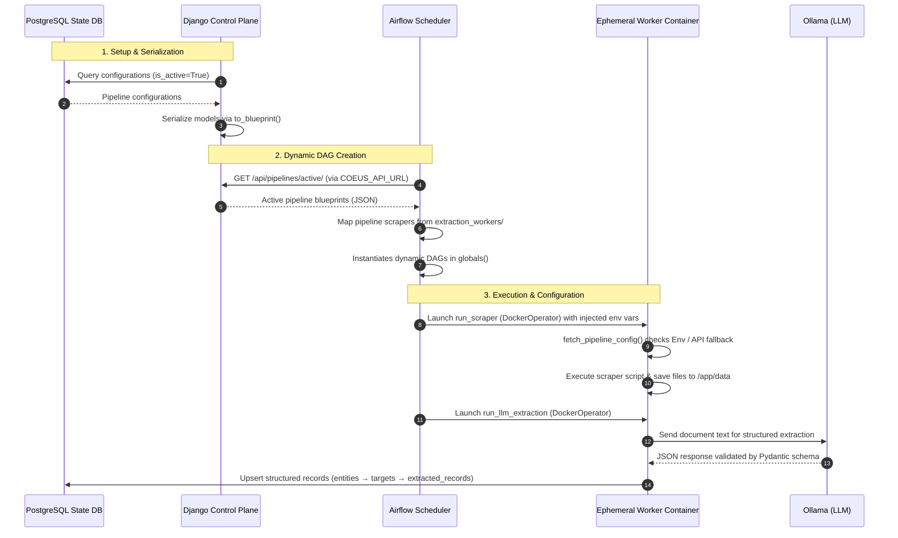

# Coeus Pipeline Architecture Analysis

This document provides a comprehensive technical analysis of the Coeus scraping, extraction, and orchestration architecture. It details how pipeline configurations defined in the Django Control Plane are serialized, transmitted to the Apache Airflow Orchestrator, dynamically translated into Airflow DAGs, and executed in ephemeral Docker containers.

---

## 🏗️ System Architecture Overview

Project Coeus uses a decoupled, three-tier architecture:
1. **Control Plane (Django)**: Manages metadata, configuration targets, CSS selectors, schedules, and LLM extraction rules. It exposes active configurations via a REST API.
2. **Orchestrator (Apache Airflow)**: Periodically queries the Control Plane to dynamically generate, schedule, and instantiate pipeline DAGs.
3. **Execution Layer (Ephemeral Docker Containers)**: Ephemeral workers run dedicated scraping scripts (using Playwright/BeautifulSoup) and LLM-based extraction jobs backed by a local **Ollama** instance.



---

## 1. ⚙️ Django Configuration & Serialization

The definition of a Coeus pipeline starts in the Django Control Plane inside the `PipelineConfiguration` model (`control_plane/pipelines/models.py`).

### 📋 Model Configurations
The model configuration is structured into three clear logical phases:

| Phase | Field Name | Type | Description |
| :--- | :--- | :--- | :--- |
| **Metadata & Scheduling** | `name` | CharField | Pipeline name (unique). |
| | `scraper_type` | CharField | Chooses the target script (e.g., `ccma_playwright`, `sedarplus`, `saflii`). |
| | `is_active` | BooleanField | Pauses/resumes scheduling. |
| | `schedule_cron` | CharField | Standard cron format (e.g., `0 0 * * *`). |
| **Phase 1: Ingestion** | `start_url` | URLField | Root entry-point for crawler. |
| | `allow_insecure_https` | BooleanField | Bypass SSL verification in Playwright. |
| | `allow_insecure_requests` | BooleanField | Bypass SSL verification in urllib3/requests. |
| **Phase 2: LLM Extraction** | `requires_extraction` | BooleanField | Whether to process documents via LLM. |
| | `llm_engine` | CharField | Selects the model provider (e.g., `ollama/phi4-mini`). |
| | `pydantic_schema_name` | CharField | Expected schema class in `schemas.py` for structured outputs. |
| | `extraction_instructions` | TextField | Custom LLM prompts or guidelines. |
| | `extraction_params` | JSONField | Key-value filters passed to the scraper (e.g. keywords, GDrive folder IDs). |
| **Phase 3: Loading** | `target_table` | CharField | Destination table where extracted JSON records are loaded. |

### 🔄 Serialization (`to_blueprint`)
The `to_blueprint()` method translates Django database state into a structured JSON structure for Airflow consumption:

```python
def to_blueprint(self) -> dict:
    return {
        "pipeline_id": self.name.lower().replace(" ", "_").replace("-", "_"),
        "name": self.name,
        "scraper_type": self.scraper_type,
        "is_active": self.is_active,
        "schedule": self.schedule_cron,
        "metadata": {
            "industry": self.industry,
            "document_type": self.document_type,
        },
        "phase_1_ingestion": {
            "start_url": self.start_url,
            "allow_insecure_https": self.allow_insecure_https,
            "allow_insecure_requests": self.allow_insecure_requests,
        },
        "phase_2_extraction": {
            "requires_extraction": self.requires_extraction,
            "engine": self.llm_engine,
            "expected_schema": self.pydantic_schema_name,
            "extraction_instructions": self.extraction_instructions,
            "extraction_params": self.extraction_params,
        },
        "phase_3_loading": {"table_name": self.target_table},
    }
```

The Django API endpoint `/api/pipelines/active/` returns a JSON object containing this blueprint for every active pipeline:
```json
{
  "pipelines": [
    {
      "pipeline_id": "saflii_courts",
      "name": "SAFLII Court Judgments",
      "scraper_type": "saflii",
      "is_active": true,
      "schedule": "0 2 * * *",
      "metadata": {
        "industry": "Legal",
        "document_type": "Court Case"
      },
      "phase_1_ingestion": {
        "start_url": "https://www.saflii.org",
        "allow_insecure_https": false,
        "allow_insecure_requests": false
      },
      "phase_2_extraction": {
        "requires_extraction": true,
        "engine": "ollama/phi4-mini",
        "expected_schema": "SafliiExtractedData",
        "extraction_instructions": "Extract applicant, respondent, dates, reportable status, court, judges, precedents, ratio decidendi, obiter dicta, order, summary, and keywords.",
        "extraction_params": {
          "parser": "saflii_document_parser",
          "content_field": "full_text"
        }
      },
      "phase_3_loading": {
        "table_name": "scrubbed_records"
      }
    }
  ]
}
```

---

## 2. 🔀 Dynamic DAG Generation (Airflow Orchestrator)

The Airflow dynamic factory (`orchestration/airflow_dags/dynamic_factory.py`) operates globally on the Airflow Scheduler.

### 🔍 Scraper Discovery Mapping
The scheduler queries local directory trees on the host to discover available Python scraper scripts.
- **Candidates searched**: `/app/extraction_workers`, `/opt/airflow/extraction_workers`, and `../extraction_workers` (relative to the DAG script).
- **Mapping mechanism**: Any script matching `*_scraper.py` is parsed. The prefix is used as the key, mapping to the container target location `/app/extraction_workers/{filename}`. E.g., `sedarplus_scraper.py` maps to `sedarplus`.

### ⚡ Dynamic DAG Instantiation
For every blueprint fetched from Django:
1. A unique DAG is configured:
   - `dag_id`: `extract_{pipeline_id}`
   - `schedule`: The exact cron schedule expression provided by the blueprint.
   - `start_date`: Defaults to `datetime(2024, 1, 1)` with `catchup=False` to prevent run-backs.
2. The dynamic DAG is registered in Python's global namespace: `globals()[dag_id] = dag`.

### 🌍 Shared Scraper Environment
Every scraper container receives a standardized set of environment variables pre-resolved by the factory:

| Variable | Value / Source |
| :--- | :--- |
| `PYTHONPATH` | `/app:/app/extraction_workers` — ensures `misstcha`, `utils`, `db`, `schemas` are importable |
| `HF_TOKEN` | Hugging Face Hub token (read from scheduler environment) |
| `PIPELINE_CONFIG` | Set to `COEUS_API_URL` |
| `START_URL` | `phase_1_ingestion.start_url` from blueprint |
| `DOCUMENT_TYPE` | `metadata.document_type` from blueprint |
| `ALLOW_INSECURE_HTTPS` / `ALLOW_INSECURE_REQUESTS` | SSL bypass flags |
| `EXTRACTION_PARAMS` | `json.dumps(extraction_params)` — always JSON-encoded |

---

## 3. 🐋 Task Construction & Bind Mounts

The orchestrator builds up to two Docker tasks for each pipeline depending on `requires_extraction`.

### 🛡️ Task 1: Ingestion (`run_scraper`)
Implemented via `DockerOperator` executing `ghcr.io/8ohm-technologies/coeus-worker:latest`.

- **Image authentication**: Uses `docker_conn_id="github_container_registry"` for GHCR pull credentials.
- **Network**: Attached to the `8ohm-network` Docker network so the container can reach the control plane and other services.

- **Execution Command**:
  - For `saflii` scraper: Command launches `Xvfb` (Virtual Framebuffer) on display `:99` to support headed Playwright browser rendering on Linux, and appends `--headless false`:
    `bash -c 'Xvfb :99 -screen 0 1280x720x24 & export DISPLAY=:99 && sleep 1 && python {worker_script} {worker_args}'`
  - For `mantech` scraper: Appends `--search_keyword` and `--category` from `extraction_params`.
  - For all other scrapers: Direct execution: `python {worker_script} --pipeline_name '{pipeline_id}'`

- **Bind Mounts**:
  1. **Data Storage**: `HOST_DATA_PATH` is bound to `/app/data` inside the container. This persists crawled files.
  2. **Scraper Scripts**: `host_workers_path` (sibling of `HOST_DATA_PATH`) is bound to `/app/extraction_workers` to allow hot-fix edits without an image rebuild.
  3. **Models Cache**: A named Docker volume `huggingface_cache` is bound to `/root/.cache/huggingface` to cache Hugging Face model weights, preventing costly re-downloads on every run.

### 🧠 Task 2: Extraction (`run_llm_extraction`)
If `requires_extraction` is enabled, a downstream extraction task is appended. This task connects to a local **Ollama** instance instead of an external API.

- **Command**: `python /app/extraction_workers/llm_extractor.py --pipeline_name '{pipeline_id}' --schema '{expected_schema}'`
- **Dependency**: `scrape_task >> extract_task`
- **Environment** (in addition to the standard set):
  - `PIPELINE_NAME`, `DOCUMENT_TYPE`, `EXTRACTION_INSTRUCTIONS`, `AI_MODEL` (e.g. `ollama/phi4-mini`)
  - `POSTGRES_HOST`, `POSTGRES_USER`, `POSTGRES_PASSWORD`, `POSTGRES_DB` — forwarded from the Airflow worker environment for direct DB upserts.
- **Bind Mounts**:
  - `HOST_DATA_PATH` is bound to `/app/data` (not `/app/data/scraped_pdfs` as before) so the extractor can navigate `/{pipeline_id}/{document_type}/`.
  - `host_workers_path` is bound to `/app/extraction_workers`.

---

## 4. 🚀 Execution & Configuration Fallbacks

When an ephemeral worker starts, it loads its configuration dynamically using `fetch_pipeline_config()` in `extraction_workers/utils/utils.py`.

```
                  ┌─────────────────────────────┐
                  │ Ephemeral Container Startup │
                  └──────────────┬──────────────┘
                                 │
                     [fetch_pipeline_config()]
                                 │
             ┌───────────────────┴───────────────────┐
             ▼                                       ▼
  Are env vars populated?                 Are env vars empty?
  (START_URL & DOCUMENT_TYPE)             (e.g., direct CLI test run)
             │                                       │
             ▼                                       ▼
 ┌───────────────────────┐               ┌───────────────────────┐
 │ Parse env config block│               │ Query Django API URL  │
 │ (json.loads on params)│               │  (COEUS_API_URL)      │
 └───────────┬───────────┘               └───────────┬───────────┘
             │                                       │
             │                                       ▼
             │                           ┌───────────────────────┐
             │                           │ Match pipeline by ID  │
             │                           │ & flatten metadata    │
             │                           └───────────┬───────────┘
             │                                       │
             └───────────────────┬───────────────────┘
                                 │
                                 ▼
                     ┌───────────────────────┐
                     │ Apply SSL disables &  │
                     │ return unified config │
                     └───────────────────────┘
```

1. **Environment Variables Check**: It looks for injected keys like `START_URL` and `DOCUMENT_TYPE`.
   - If present, it parses `EXTRACTION_PARAMS` using `json.loads()` (the factory now always JSON-encodes this value, so no `ast.literal_eval` fallback is needed).
2. **API Fallback**: If those environment variables are missing (e.g., during direct developer testing inside a shell), it queries the Django `COEUS_API_URL` to fetch all active blueprints, matches the pipeline by name or ID, and flattens the nested blueprint phases into a unified configuration.
3. **Database Upserts**: The LLM extractor worker loads results directly into PostgreSQL using `asyncpg` via `extraction_workers/db.py`. The connection target (`POSTGRES_HOST`) defaults to `cloud-sql-proxy` but can be overridden via environment variable.

---

## 5. 🛡️ `misstcha` — CAPTCHA Solver Package

The `misstcha/` directory is a first-party Python package bundled directly into the worker image (`COPY misstcha/ ./misstcha/`). It is importable because `PYTHONPATH` includes `/app`.

### Module Structure

| Module | Purpose |
| :--- | :--- |
| `__init__.py` | Exports `HCaptchaSolver`, `TurnstileSolver`, `CaptchaSolverFactory`, `solve_captcha` |
| `base.py` | `BaseSolver` abstract class defining the `solve(page, ...)` interface |
| `hcaptcha.py` | `HCaptchaSolver` — slices the 3×3 grid, runs Grounding DINO per-cell, clicks matched cells |
| `turnstile.py` | `TurnstileSolver` — finds the `challenges.cloudflare.com` iframe and clicks the checkbox |
| `factory.py` | `CaptchaSolverFactory` registry + `solve_captcha()` helper |
| `translator.py` | `PromptTranslator` — uses Qwen LLM to convert hCaptcha challenge text into DINO-friendly prompts |
| `vision.py` | `VisionManager` — wraps Grounding DINO for zero-shot object detection on image bytes |
| `utils.py` | Shared utility functions |

### Turnstile Solver Flow (SAFLII)
The `TurnstileSolver` is the primary solver used by `saflii_scraper.py`:

1. Polls `page.frames` until a frame from `challenges.cloudflare.com` is found (up to `check_timeout` seconds).
2. Waits `solve_delay` seconds (default 7s) for the challenge widget to fully render.
3. Retrieves the iframe's bounding box and clicks at the checkbox coordinates `(box.x + 30, box.y + 32)`.
4. Optionally waits for a `wait_selector` to confirm navigation after the solve.

---

## 6. 🗄️ LLM Extractor — Data Schema, Parsed Records & DB Upsert

`llm_extractor.py` enforces a multi-level PostgreSQL pipeline structure with comprehensive lifecycle timestamps:

```
entities          (id UUID PK, name TEXT UNIQUE, created_at TIMESTAMPTZ)
    └── targets   (id UUID PK, entity_id FK, target_name TEXT, location TEXT, target_type TEXT, created_at TIMESTAMPTZ, UNIQUE(entity_id, target_name))
            └── extracted_records  (id UUID PK, target_id FK, document_date DATE,
                                    record_type TEXT, data JSONB,
                                    requires_human_review BOOL, review_reason TEXT,
                                    source_url TEXT UNIQUE, status TEXT,
                                    scraped_at TIMESTAMPTZ, detailed_at TIMESTAMPTZ,
                                    parsed_at TIMESTAMPTZ, scrubbed_at TIMESTAMPTZ,
                                    updated_at TIMESTAMPTZ)
                    ├── parsed_records   (id UUID PK, extracted_record_id FK UNIQUE, data JSONB,
                    │                     created_at TIMESTAMPTZ, updated_at TIMESTAMPTZ)
                    └── scrubbed_records (id UUID PK, extracted_record_id FK UNIQUE, data JSONB,
                                          created_at TIMESTAMPTZ, updated_at TIMESTAMPTZ)
```

### Lifecycle Timestamps & Pipeline Progression

| Stage | Table | Timestamp Field | Purpose / Trigger |
| :--- | :--- | :--- | :--- |
| **Discovery** | `extracted_records` | `scraped_at` | Initial scrape / index pass when URL is discovered (`status = 'indexed'`) |
| **Enrichment** | `extracted_records` | `detailed_at` | Full document text and detail scraping pass (`status = 'detailed'`) |
| **Segmentation** | `extracted_records`<br>`parsed_records` | `parsed_at`<br>`created_at`, `updated_at` | Section parser splits text into header, judgment, order, footnotes |
| **PII Scrubbing** | `extracted_records`<br>`scrubbed_records` | `scrubbed_at`<br>`created_at`, `updated_at` | LLM schema validation & regex PII scrubbing into structured output |
| **Modification** | All tables | `updated_at` | Auto-updated on any row change via PostgreSQL `BEFORE UPDATE` triggers |

### Document Section Parsing (`ParsedRecord`)

When `parser` is configured in `extraction_params` (e.g. `"parser": "saflii_document_parser"`):
1. **Parsing Phase**: `llm_extractor.py` runs `run_parser_phase()` prior to LLM extraction. On SAFLII pipelines, it strictly filters and processes records in the `"cases"` category (skipping journals, gazettes, and court rolls which are handled programmatically). It executes the resolved section parser (e.g. `split_saflii_document()`) in configurable batches (default 250 records/batch) to maintain low memory usage and prevent database timeouts.
2. **Section Storage**: Parsed document sections (`header`, `judgment`, `order`, `appearances`, `footnotes`) are saved in the `parsed_records` table (1:1 relation with `extracted_records`).
   - **Footnote & Trailing Order Handling**: Footnote extraction prioritizes DOM-structured containers (`div#ftn`, `p.footnote`) and sequential plain-text fallback (`[1]` followed by `[2]`), and includes trailing order rescue logic: if footnotes occur prior to the order in the judgment, the order and subsequent appearances are restored to the document body rather than being truncated.
   - **Order Pattern Coverage**: Supports explicit order headers, plural orders, appellate proposals, Afrikaans rulings (`afgewys`, `van die hand gewys`, `van die rol geskrap`), sentencing substitutions, inline rulings, and judicial signature boundaries. Order extraction is decoupled before Appearances to prevent premature truncation.
3. **Automated Review Flagging**: If section parsing fails to extract core required sections (returning `null_values`), the parent `extracted_record` is automatically updated with `requires_human_review = TRUE` and `review_reason = 'Document parsing failed'`. Records marked for human review are automatically skipped by both the section parser and downstream LLM extraction.
4. **Section-Targeted Extraction Dataflow**: The downstream LLM extraction step routes context dynamically per field range:
    - **Pass 1 (Header, Coram & Bench Context)**: Fields 1–8 (`applicant_plaintiff` to `court_location`) receive the structured `Header` text together with the initial `Judgment Intro` (containing authoring judge and concurring panel coram) and `Appearances`. This ensures 100% visibility for presiding judges while preventing litigant/counsel hallucinations. The AI model is provided with the standardized catalog of South African courts (e.g., `ZACC` = Constitutional Court of South Africa, `ZASCA` = Supreme Court of Appeal of South Africa) and strict instructions to output judge names in Title Case with uppercase judicial title abbreviations. If the LLM times out or fails on identifying fields, a heuristic fallback extracts court, parties, and decision date from record metadata before flagging human review. If all extraction methods fail, the record is flagged with `requires_human_review = TRUE` with the missing fields documented in `review_reason` and skipped, avoiding full-document context overflows.
    - **Pass 2 (Footnotes & Precedents Context)**: `precedents_cited` receives ONLY the `footnotes` section text context (via `SafliiPrecedentsData`) and parses citations into the structured 5-part schema (`case_name`, `case_number`, `neutral_citation`, `commercial_citations`, `decision_date`, `treatment`, `reasoning`, `url`).
    - **Pass 3 (Judgment & Order Context)**: Body fields (`ratio_decidendi`, `obiter_dicta`, `order`, `summary`, `keywords`) receive `Judgment` + `Order` section text, with enforced 5–10 legal topic keyword extraction.
    - **Post-Processing Normalization**: Outputs are automatically normalized via `normalize_court_name()` (mapping target codes and regional descriptions to canonical court names) and `format_judge_name()` (converting all-caps judge names like `MAHLANGA AJ` to `Mahlanga AJ` while retaining acronyms and particles), validated against `SafliiExtractedData`, PII-scrubbed, and saved into `scrubbed_records`.

### Pydantic Schemas (`extraction_workers/schemas/`)

Pydantic schemas are organized into modular files within the `extraction_workers/schemas/` package:
- [`generic.py`](file:///home/tiaanf/Dev/coeus/extraction_workers/schemas/generic.py): Base schemas for core record metadata, data quality verification flags, and generic extraction payloads.
- [`saflii.py`](file:///home/tiaanf/Dev/coeus/extraction_workers/schemas/saflii.py): Specialized schemas for SAFLII court judgments, precedents, journals, gazettes, and court rolls.

| Class | Module | Purpose |
| :--- | :--- | :--- |
| `DataQualityFlags` | `generic.py` | `requires_human_review` bool + `review_reason` string for LLM self-verification |
| `BaseExtractedRecord` | `generic.py` | Common metadata: `entity_name`, `target_name`, `document_date`, `record_type` |
| `GenericDocumentExtraction` | `generic.py` | Default schema: wraps `BaseExtractedRecord`, a free-form `extracted_data` dict, and `DataQualityFlags` |
| `SafliiJournalGazetteExtraction` | `saflii.py` | Standalone schema for SAFLII Journals and Gazettes: contains `title`, `formatted_text` (plain text), and optional data quality flags (no `metadata` field) |
| `SafliiCourtRollExtraction` | `saflii.py` | Standalone schema for SAFLII Court Rolls: contains `title`, `roll_type`, tabular `rows`, and optional data quality flags (no `metadata` field) |

The extractor dynamically resolves the schema class from the `schemas` package by name at runtime. If the named class is not found, it falls back to `GenericDocumentExtraction`. For SAFLII pipelines, `llm_extractor.py` strictly scopes both section parsing and LLM extraction/scrubbing to `"cases"` (mapping to `SafliiExtractedData` wrapped in `SafliiCaseExtraction`). Non-case categories (gazettes, journals, court rolls) bypass LLM parsing/extraction.

### Maintenance & Pipeline Utilities

- **Failed SAFLII Records Reprocessor** ([`scripts/reprocess_failed_saflii_records.py`](file:///home/tiaanf/Dev/coeus/scripts/reprocess_failed_saflii_records.py)):
  Batch reprocesses records flagged with `requires_human_review = TRUE` and `review_reason = 'Document parsing failed'`, runs the enhanced section parser in chunked batches, updates `parsed_records.data`, and clears review flags in `extracted_records`:
  ```bash
  # Preview what would be recovered without modifying DB:
  python scripts/reprocess_failed_saflii_records.py --dry-run

  # Execute live database reprocessing:
  python scripts/reprocess_failed_saflii_records.py --force
  ```

- **Cases Reset Utility** ([`scripts/reset_saflii_cases.py`](file:///home/tiaanf/Dev/coeus/scripts/reset_saflii_cases.py)):
  Allows safely resetting case extraction states across `scrubbed_records`, `parsed_records`, and `extracted_records` (sets `status='detailed'`, clears timestamps and flags) to re-run parsing and multi-pass extraction with updated schemas or context rules:
  ```bash
  # Preview cases to reset without modifying data:
  python scripts/reset_saflii_cases.py --dry-run

  # Reset all SAFLII case records (interactive or --force):
  python scripts/reset_saflii_cases.py --force

  # Target specific court (e.g. ZACC or ZACAC):
  python scripts/reset_saflii_cases.py --target ZACC --force
  ```

- **Journal Records Cleaner Utility** ([`scripts/fix_saflii_journal_records.py`](file:///home/tiaanf/Dev/coeus/scripts/fix_saflii_journal_records.py)):
  Cleans LawCite website navigation breadcrumbs, SAFLII UI noise lines, and excess blank lines from existing journal entries in `scrubbed_records`:
  ```bash
  # Preview journal records to clean without modifying data:
  python scripts/fix_saflii_journal_records.py --dry-run

  # Clean and update journal entries:
  python scripts/fix_saflii_journal_records.py --force
  ```

- **Case Records Court & Judge Normalizer Utility** ([`scripts/fix_saflii_case_records.py`](file:///home/tiaanf/Dev/coeus/scripts/fix_saflii_case_records.py)):
  Standardizes court names (to canonical names) and formats judge names (to Title Case with uppercase judicial title acronyms) across existing case entries in `scrubbed_records`:
  ```bash
  # Preview case records to normalize without modifying data:
  python scripts/fix_saflii_case_records.py --dry-run

  # Normalize and update case entries:
  python scripts/fix_saflii_case_records.py --force

  # Target specific court (e.g. ZACC, ZASCA, ZAGPJHC):
  python scripts/fix_saflii_case_records.py --target ZACC --force
  ```

- **Case Records Document Date Normalizer Utility** ([`scripts/fix_saflii_document_dates.py`](file:///home/tiaanf/Dev/coeus/scripts/fix_saflii_document_dates.py)):
  Extracts and resolves exact decision dates from case record title strings (e.g., matching trailing brackets `... (13 April 2004)`), updating `scrubbed_records` metadata and optionally synchronizing `extracted_records.document_date` across the database:
  ```bash
  # Preview case records with date mismatches without modifying data:
  python scripts/fix_saflii_document_dates.py --dry-run

  # Normalize and update case document dates:
  python scripts/fix_saflii_document_dates.py --force

  # Target specific court (e.g. ZACC, ZACT, ZASCA):
  python scripts/fix_saflii_document_dates.py --target ZACC --force
  ```

- **Case Records Case Number Normalizer Utility** ([`scripts/fix_saflii_case_numbers.py`](file:///home/tiaanf/Dev/coeus/scripts/fix_saflii_case_numbers.py)):
  Extracts and normalizes authoritative case numbers from title strings (matching `... (CASE_NUM) [YEAR] ZA...`) and judgment headers, replaces corrupt neutral citations and leaked precedent citations, and synchronizes `case_number` across `scrubbed_records` metadata and `extracted_records`:
  ```bash
  # Preview case number changes without modifying data:
  python scripts/fix_saflii_case_numbers.py --dry-run

  # Normalize and update case numbers across all targets:
  python scripts/fix_saflii_case_numbers.py --force

  # Target specific court (e.g. ZACC, ZACT, ZASCA):
  python scripts/fix_saflii_case_numbers.py --target ZACC --force
  ```

- **PDF Case Titles & Dates Normalizer Utility** ([`scripts/fix_saflii_pdf_case_titles.py`](file:///home/tiaanf/Dev/coeus/scripts/fix_saflii_pdf_case_titles.py)):
  Identifies cases sourced from PDFs where titles were stored as PDF filenames or internal metadata, fetches companion SAFLII `.html` pages to resolve true `<h2>` case titles and decision dates, updating `extracted_records` and `scrubbed_records`:
  ```bash
  # Preview PDF case titles to fix without modifying data:
  python scripts/fix_saflii_pdf_case_titles.py --dry-run --limit 10

  # Normalize and update all PDF case titles & dates:
  python scripts/fix_saflii_pdf_case_titles.py --force

  # Target specific court (e.g. ZACT, ZACC, ZAGPJHC):
  python scripts/fix_saflii_pdf_case_titles.py --target ZACT --force
  ```

- **Footnotes & Structured Precedents Normalizer Utility** ([`scripts/fix_saflii_footnotes_records.py`](file:///home/tiaanf/Dev/coeus/scripts/fix_saflii_footnotes_records.py)):
  Migrates legacy `citations` in `parsed_records` to `footnotes`, and standardizes `precedents_cited` in `scrubbed_records` into the 5-part structured citation schema (`case_name`, `case_number`, `neutral_citation`, `commercial_citations`, `decision_date`, `treatment`, `reasoning`, `url`, `raw_citation`):
  ```bash
  # Preview footnotes and precedent migrations without modifying data:
  python scripts/fix_saflii_footnotes_records.py --dry-run

  # Normalize and update all records:
  python scripts/fix_saflii_footnotes_records.py --force

  # Target specific court (e.g. ZACC, ZASCA):
  python scripts/fix_saflii_footnotes_records.py --target ZACC --force
  ```

- **Image OCR Text Extraction Utility** ([`scripts/extract_image_ocr.py`](file:///home/tiaanf/Dev/coeus/scripts/extract_image_ocr.py)):
  Extracts text, bounding boxes, and confidence scores from document images using high-performance ONNX-based RapidOCR (pure-Python execution with zero external C++ dependencies) or Tesseract, with optional image preprocessing filters:
  ```bash
  # Basic text extraction from an image:
  python scripts/extract_image_ocr.py document_page.png

  # Structured JSON output with bounding boxes and line confidences:
  python scripts/extract_image_ocr.py document_page.png --format json

  # Save output to a file with binarization preprocessing:
  python scripts/extract_image_ocr.py document_page.png --preprocess binarize -o extracted.txt

  # Pipe friendly (quiet mode for Unix shell workflows):
  python scripts/extract_image_ocr.py document_page.png --quiet
  ```

---


> [!TIP]
> **Performance Recommendation**:
> While HuggingFace model weights are cached using the `huggingface_cache` Docker volume, Playwright browser installations (typically in `~/.cache/ms-playwright`) are not currently cached. Adding a bind mount or named volume for `ms-playwright` will speed up scraper container startup times significantly.

> [!WARNING]
> **Failure Isolation**:
> If the Django Control Plane goes down, the Airflow dynamic DAG factory will fail to fetch blueprints during its parsing cycle, resulting in an empty pipeline list (`blueprints = []`). Previously generated DAGs will disappear from the Airflow UI if the API remains offline, effectively unregistering the pipelines. Implement a local blueprint cache file on the Airflow scheduler host to serve as a fallback when the Control Plane is unreachable.

> [!NOTE]
> **SAFLII GDrive Integration**:
> When `gdrive_folder_id` is set in `extraction_params`, the SAFLII scraper uploads each downloaded PDF and JSON metadata file to Google Drive after saving it locally. Setting `gdrive_delete_local: true` in `extraction_params` causes local copies to be removed after a successful upload, enabling near-zero local disk usage for long-running crawls. It pulls existing file lists directly from Google Drive (or local output folder if GDrive is disabled) to initialize its in-memory deduplication set, preventing re-downloading files already saved.
